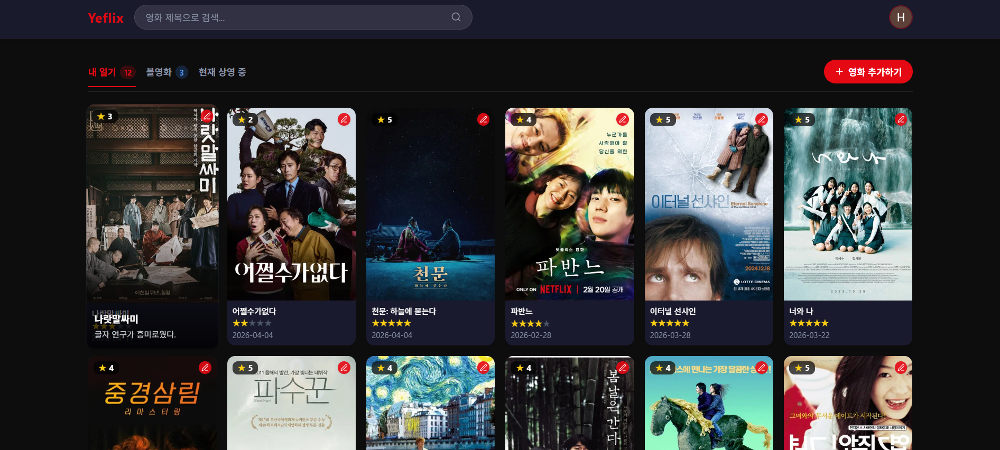
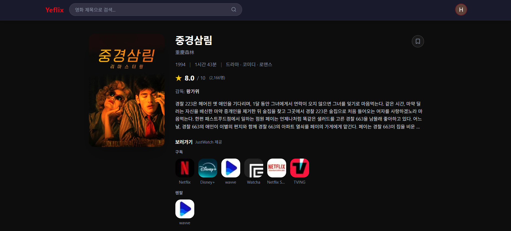

# Yeflix

영화를 검색하고, OTT 플랫폼 바로가기를 확인하며, 별점과 감상 일기를 남길 수 있는 개인 영화 기록 서비스입니다.

영화를 보기 시작한 후 감상문을 직접 기록하고 싶어서 만들게 되었습니다.

---

## 스크린샷

### 홈 화면



### 영화 상세 페이지



---

## 주요 기능

| 기능 | 설명 |
|------|------|
| 현재 상영 중 | TMDB 기준 현재 상영 중인 영화 목록 조회 |
| 영화 검색 | 제목으로 영화 검색 |
| 영화 상세 | 포스터, 장르, 상영시간, 감독, 출연진, TMDB 평점 확인 |
| OTT 바로가기 | Netflix, Disney+, Watcha 등 국내 스트리밍 플랫폼 링크 제공 (JustWatch 데이터) |
| 볼영화 찜 | 보고 싶은 영화를 북마크로 저장 |
| 감상 일기 | 별점, 관람 날짜, 감상문, 태그를 포함한 영화 일기 작성·수정·삭제 |
| Google 로그인 | Google 계정으로 간편 로그인 |

---

## 사용 기술

- **Framework**: Next.js 14 (App Router)
- **Styling**: Tailwind CSS
- **Auth & DB**: Firebase Authentication, Firestore
- **API**: TMDB (The Movie Database)

---

## API 정보

### TMDB API

영화 정보 전반(목록, 검색, 상세, 출연진, OTT 정보)을 제공합니다.

- 사이트: [https://www.themoviedb.org](https://www.themoviedb.org)
- API 문서: [https://developer.themoviedb.org/docs](https://developer.themoviedb.org/docs)
- 사용 엔드포인트:

| 엔드포인트 | 설명 |
|-----------|------|
| `GET /movie/now_playing` | 현재 상영 중인 영화 목록 |
| `GET /movie/popular` | 인기 영화 목록 |
| `GET /movie/upcoming` | 개봉 예정 영화 목록 |
| `GET /search/movie` | 영화 검색 |
| `GET /movie/{id}` | 영화 상세 정보 |
| `GET /movie/{id}/credits` | 감독 및 출연진 |
| `GET /movie/{id}/watch/providers` | 국내 OTT 스트리밍 정보 |

### Firebase

사용자 인증과 일기/찜 데이터 저장에 사용합니다.

- **Authentication**: Google 소셜 로그인
- **Firestore**: 영화 일기, 볼영화 찜 목록 저장

---

## 환경 변수

`.env.local` 파일을 프로젝트 루트에 생성하고 아래 값을 설정하세요.

```env
NEXT_PUBLIC_TMDB_API_KEY=your_tmdb_api_key

NEXT_PUBLIC_FIREBASE_API_KEY=your_firebase_api_key
NEXT_PUBLIC_FIREBASE_AUTH_DOMAIN=your_project.firebaseapp.com
NEXT_PUBLIC_FIREBASE_PROJECT_ID=your_project_id
NEXT_PUBLIC_FIREBASE_STORAGE_BUCKET=your_project.appspot.com
NEXT_PUBLIC_FIREBASE_MESSAGING_SENDER_ID=your_sender_id
NEXT_PUBLIC_FIREBASE_APP_ID=your_app_id
```

---

## 로컬 실행

```bash
npm install
npm run dev
```
